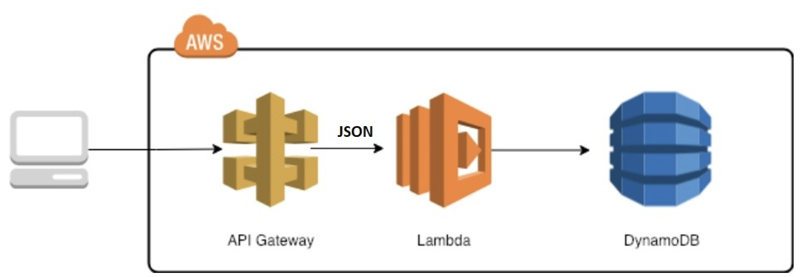

# lambda_python
Lambda python

This repository contains the code that implements a AWS Lambda in Python as ilustrated in the picture bellow:

It ilustrates some practices that should be considered when developing an AWS Lambda, such as:
1. Choosing an architectural pattern
2. Defining how to implement desirable features like log, trace, validation, exception handling, etc

We are using code style [Black](https://medium.com/ki-labs-engineering/any-code-style-you-like-as-long-its-black-7a3cc4edd90)

A sample of the payload can be found in the [testfile](./app/tests//test_lambda_function.py).

The payload must contain a json with some specific fields as described in the [jsonschema](./app/adapters/input_schema.json)

The DynamoDb expected to exist in order for the sample works can also be found in the [testfile](./app/tests//test_lambda_function.py).